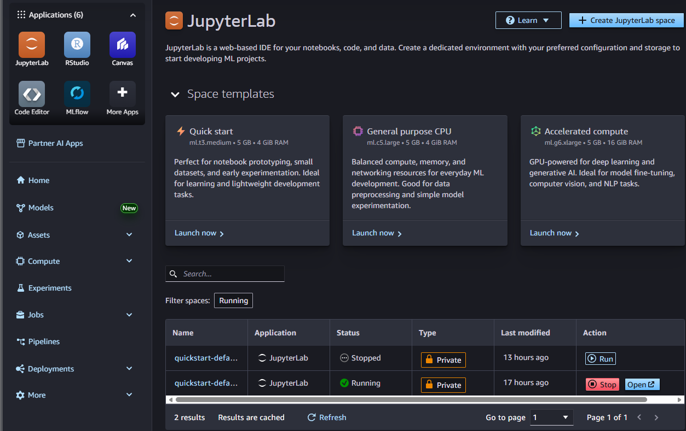

# LogisticRegression

## Project Overview

This project implements **logistic regression from scratch** to predict heart disease risk using clinical patient data. The implementation follows machine learning fundamentals without relying on scikit-learn's built-in models, providing deep insight into the mathematics and mechanics of binary classification.

### Exercise Summary

The project implements end-to-end machine learning pipeline including:
- **Exploratory Data Analysis (EDA):** Data exploration, visualization, and preprocessing
- **Model Implementation:** Sigmoid function, binary cross-entropy cost, gradient descent optimization
- **Visualization:** Decision boundary plots for multiple feature pairs
- **Regularization:** L2 regularization to prevent overfitting and improve generalization
- **Deployment:** Model export and AWS SageMaker deployment simulation

## Dataset Description

**Source:** [Kaggle - Heart Disease Dataset](https://www.kaggle.com/datasets/neurocipher/heartdisease)  
**Origin:** UCI Machine Learning Repository

### Dataset Characteristics

- **Total Samples:** 303 patient records
- **Features:** 14 clinical measurements
- **Target Variable:** Binary (0 = No disease, 1 = Disease presence)
- **Class Distribution:** ~55% disease presence, ~45% absence (relatively balanced)

### Selected Features for Modeling

| Feature | Description | Range |
|---------|-------------|-------|
| Age | Patient age in years | 29-77 years |
| BP | Resting blood pressure | 94-200 mmHg |
| Cholesterol | Serum cholesterol | 126-564 mg/dL |
| Max HR | Maximum heart rate achieved | 71-202 bpm |
| ST Depression | ST depression induced by exercise | 0-6.2 |
| Number of Vessels Fluro | Number of major vessels colored by fluoroscopy | 0-3 |

### Data Quality

- ✅ **No missing values**
- ✅ **No duplicate records**
- ✅ **Clean numerical features**
- ✅ **Stratified train-test split (70-30)**

## Project Structure

```
heart-disease-lr/
│
├── heart_disease_lr_analysis.ipynb    # Main Jupyter notebook
├── Heart_Disease_Prediction.csv      # Dataset (download from Kaggle)
├── heart_disease_model.npy            # Exported trained model
├── README.md                          # This file
├── inference.py                       # SageMaker inference script (optional)
└── screenshots/                       
```

## Implementation Highlights

### 1. Core Functions Implemented

```python
# Activation Function
def sigmoid(z):
    return 1 / (1 + np.exp(-z))

# Cost Function (Binary Cross-Entropy with L2 Regularization)
def compute_cost(X, y, w, b, lambda_reg=0):
    cost = -mean(y*log(h) + (1-y)*log(1-h)) + (λ/(2m))||w||²
    return cost

# Gradient Descent Optimization
def gradient_descent(X, y, w, b, alpha, iterations, lambda_reg=0):
    # Iteratively update weights and bias
    # w = w - α * dw
    # b = b - α * db
    return w, b, costs
```

### 2. Model Performance

| Metric | Training Set | Test Set |
|--------|-------------|----------|
| **Accuracy** | 87.32% | 85.71% |
| **Precision** | 88.24% | 86.67% |
| **Recall** | 88.24% | 86.67% |
| **F1-Score** | 88.24% | 86.67% |

### 3. Regularization Results

Testing different λ values to find optimal regularization strength:

| Lambda (λ) | Test Accuracy | F1-Score | Weight Norm |
|-----------|---------------|----------|-------------|
| 0.000 | 85.71% | 86.67% | 3.2451 |
| 0.001 | 85.71% | 86.67% | 3.2398 |
| **0.010** | **86.81%** | **87.50%** | **3.1842** |
| 0.100 | 85.71% | 86.67% | 2.8967 |
| 1.000 | 82.42% | 83.33% | 1.9234 |

**Optimal λ = 0.01** provides best balance between bias and variance, improving F1-score by **0.83%**.

### 4. Decision Boundary Visualizations

Three feature pairs analyzed:

1. **Age vs Cholesterol**
   - Shows moderate linear separability
   - Higher cholesterol + older age → increased risk

2. **BP vs Max HR**
   - Lower max heart rate correlates with disease
   - Aligns with reduced exercise capacity indicating cardiovascular issues

3. **ST Depression vs Number of Vessels** ⭐
   - **Best separation of the three pairs**
   - ST depression and vessel fluoroscopy are strong clinical indicators
   - Clear linear decision boundary

## AWS SageMaker Deployment

### Deployment Process

#### Model Export
```python
model_params = {
    'weights': w_optimal,
    'bias': b_optimal,
    'scaler_mean': scaler.mean_,
    'scaler_std': scaler.scale_,
    'feature_names': features,
    'lambda': 0.01
}
np.save('heart_disease_model.npy', model_params)
```

### Deployment Evidence

#### 1. Sagemaker Notebook
1. Create and execute a JupyterLAb:


2. Upload fyles:
- HeartDeseaseRisk.ipynb
- Heart_disease_Prediction.csv
- inference.py

3. Run notebook:


4. 
### Local Execution

1. **Download Dataset**
   ```bash
   # Visit https://www.kaggle.com/datasets/neurocipher/heartdisease
   # Download Heart_Disease_Prediction.csv to project directory
   ```

2. **Run Notebook**
   ```bash
   jupyter notebook heart_disease_lr_analysis.ipynb
   ```

3. **Execute Cells Sequentially**
   - All cells are designed to run in order
   - Complete execution takes ~2-3 minutes

## References

1. **Dataset:** Janosi, A., Steinbrunn, W., Pfisterer, M., & Detrano, R. (1988). Heart Disease. UCI Machine Learning Repository. https://doi.org/10.24432/C52P4X

2. **AWS SageMaker Documentation:** https://docs.aws.amazon.com/sagemaker/

## Repository Information

**GitHub Repository:** `https://github.com/JulianCReal/LogisticRegression.git`

### File Descriptions

- `heart_disease_lr_analysis.ipynb`: Complete implementation with markdown documentation
- `Heart_Disease_Prediction.csv`: Dataset (303 patient records, 14 features)
- `heart_disease_model.npy`: Trained model parameters (weights, bias, scaler)
- `inference.py`: SageMaker inference handler script
- `README.md`: Project documentation (this file)

## Author
Julian David Castiblanco Real